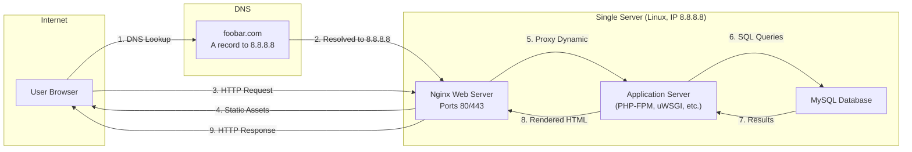

## Simple Web Stack

A user opens their browser, types **www.foobar.com**, and presses Enter. The browser first resolves "**www.foobar.com**" to the server’s IP address (8.8.8.8) via DNS, then establishes a TCP connection to port 80 (HTTP), sends an HTTP GET request to the Nginx web server, which forwards dynamic requests to the application server layer, retrieves or updates data in the MySQL database, and finally returns the rendered web page over HTTP back to the user’s browser. This one‑server LAMP‑style setup—comprising a Linux host running Nginx, an application runtime (e.g., PHP/Python), and MySQL—illustrates the basic flow of a web request, the role of DNS, and key single‑server limitations like SPOF, downtime during maintenance, and limited scalability.

## Infrastructure Design

### Domain and DNS

* **Domain Name (foobar.com):** Provides a human‑readable address mapped to an IP. It’s registered with a registrar and managed via DNS.
* **www Subdomain `www.foobar.com`:** A third‑level domain (hostname) configured with an **A record** pointing “www” to 8.8.8.8.

### Server Components

* **Web Server (Nginx):** Listens for HTTP requests on port 80 (or HTTPS on 443), serves static content directly, and forwards dynamic requests to the application runtime.
* **Application Server:** Hosts and executes application code (e.g., PHP with PHP‑FPM, Python with uWSGI). It processes business logic, generates dynamic content, and interacts with the database.
* **Database (MySQL):** Stores and retrieves structured data. The application layer issues SQL queries over a socket or TCP/IP connection to MySQL, which returns results for rendering.

### Communication Protocol

* **DNS Lookup:** The browser queries DNS for the A record of “www.foobar.com” → 8.8.8.8.
* **TCP/IP:** A TCP connection is established between the client and server on port 80 (HTTP).
* **HTTP:** The browser sends an HTTP request (e.g., `GET / HTTP/1.1`), and the server responds with status codes (e.g., 200 OK) and content.

## Roles Explained

### What Is a Server?

A **server** is a networked computer that provides services (like web hosting, databases) to client devices under the client‑server model.

### Role of the Domain Name

The domain name abstracts the numeric IP address into a memorable label, allowing resources to move without changing the address users type.

### Type of DNS Record for “www”

An **A record** maps the hostname **“www.foobar.com”** directly to its IPv4 address (8.8.8.8).

### Role of the Web Server

The web server handles HTTP(S) communication, serves static assets, and proxies dynamic requests to the application server.

### Role of the Application Server

The application server executes business logic, processes data, manages sessions, and generates dynamic HTML or API responses.

### Role of the Database

MySQL stores, retrieves, and manages relational data; it ensures data integrity, query optimization, and user access control.

### Communication Channel

The server communicates with the user’s browser over **TCP/IP** using the **HTTP** protocol on standard ports (80/443), ensuring reliable, ordered delivery of requests and responses.

## Challenges & Limitations

### Single Point of Failure (SPOF)

With everything on one server, the server itself is a SPOF—any hardware, OS, or software failure halts the entire service.

### Downtime for Maintenance

Applying updates or restarting Nginx/app layers requires taking the machine offline, causing service interruption. Techniques like blue‑green deployments exist to mitigate this, but without them, expect downtime.

### Scalability Limits

A single machine can only scale **vertically** up to hardware limits (CPU, RAM, I/O). Beyond that, you cannot handle additional traffic without migrating to **horizontal** scaling (multiple servers).
