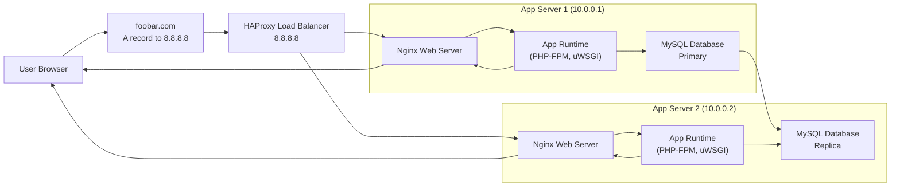

## Distributed web infrastructure

We introduce an **HAProxy load balancer** in front of two **identical LAMP application servers**, each hosting Nginx, the application, and a MySQL instance. The load balancer uses a **round‑robin** algorithm to evenly distribute incoming HTTP requests. The database runs in a **Primary‑Replica** cluster: writes go to the Primary and replicate asynchronously to the Replica. This setup enables **horizontal scaling**, **fault isolation**, and **read–write separation**, but still has SPOFs at the load balancer and the Primary database.  It also lacks security hardening or monitoring.

---

---

## Infrastructure Components

* **HAProxy Load Balancer**

  * **Reason:** Distributes client requests across multiple backend servers to improve throughput and availability.

* **Two App Servers** (each with Nginx, App, MySQL)

  * **Reason:** Provides redundancy and horizontal scaling for web and application tiers. If one server fails or is under maintenance, traffic continues to the othe.

* **MySQL Primary‑Replica Cluster**

  * **Reason:** Separates write and read workloads: writes hit the Primary; read‑only queries can be routed to the Replica, offloading the Primary and improving performance.

---

## Load Balancer Details

### Distribution Algorithm: Round‑Robin

HAProxy’s **round‑robin** algorithm cycles through backend servers in order, giving each an equal share of requests. It assumes homogeneous capacity; you can also assign **weights** to account for differing server capabilities.

### Active‑Active vs Active‑Passive

* **Active‑Active:** Both load balancers/processors handle traffic concurrently; failure of one reduces capacity but does not stop service.
* **Active‑Passive:** A standby load balancer remains idle until the active one fails, then takes over via failover. This prevents capacity usage but provides seamless takeover.

> Our design uses a **single HAProxy** instance (Active‑Active would require two LBs with shared state; Active‑Passive would need a hot standby), so this remains a SPOF.

---

## MySQL Primary‑Replica Cluster

### How It Works

* **Primary (Source):** Accepts all write transactions, commits them, and logs changes.
* **Replica(s):** Connect asynchronously to the Primary, read its binary log, and apply events locally to maintain a copy of the data.

### Primary vs Replica for the Application

* **Primary Node:** Handles **all writes** (CREATE/UPDATE/DELETE). Applications must connect here for data mutations.
* **Replica Node:** Serves **read‑only** traffic (SELECT queries) to scale out read workloads. If an application accidentally writes to a Replica, the change will be rejected or lost, depending on configuration.

---

## Remaining Issues

1. **Single Points of Failure (SPOF)**

   * **Load Balancer:** One HAProxy instance → if it fails, entire service is unavailable.
   * **Database Primary:** Only one write node; failure halts all writes and disrupts replication.

2. **Security Gaps**

   * **No Firewall/ACLs:** All ports are exposed unless network‑level controls are applied.
   * **No HTTPS/TLS:** Traffic in plaintext, vulnerable to eavesdropping and MITM (*Man In The Middle*).

3. **Lack of Monitoring & Alerting**

   * No health checks beyond HAProxy’s basic TCP checks, no metrics on CPU/memory/query performance, and no centralized logging.
