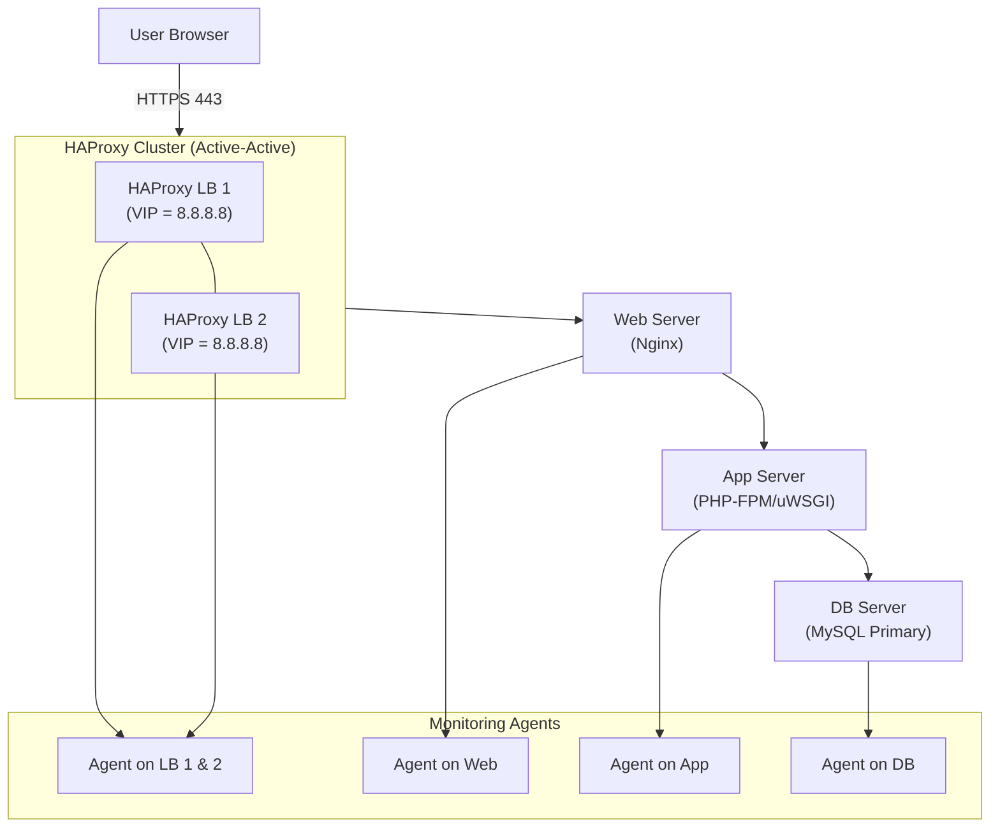

## Scaling Up

### Why we added each element

1. **Second HAProxy node (LB₂)**

   * **Reason:** Eliminates the load balancer SPOF by forming an Active‑Active cluster with a shared Virtual IP (VIP). Both LBs receive traffic and replicate session state with Keepalived or TrafficSync.

2. **Dedicated Web Server**

   * **Reason:** Offloads static content and TLS termination from the application server, improving cacheability and reducing attack surface on your app tier.

3. **Dedicated Application Server**

   * **Reason:** Runs business logic in isolation—scales independently of web tier and limits resource contention (CPU / memory) between serving files and executing code.

4. **Dedicated Database Server**

   * **Reason:** Centralizes data storage for consistency and easier backups. Isolates I/O‑heavy DB operations from web and app workloads, enabling specialized tuning.

5. **Fourth “New” Server**

   * **Reason:** This is the **database server**. By adding it as a separate node, you’ve split each LAMP component onto its own machine, eliminating resource contention and simplifying scaling per tier.

### Key Details

* **HAProxy Active‑Active**

  * Uses **Keepalived** (or similar) to share a floating VIP between LB₁ and LB₂. Both serve traffic simultaneously, providing capacity and resilience; failure of one still leaves the VIP active on the other.

* **Flow Separation**

  * **TLS Termination** at the web tier (or LB tier) ensures encrypted traffic from clients arrives decrypted in a hardened, single‑purpose web server.
  * **Nginx on Web Server** handles static files, caching, and proxies dynamic routes.
  * **App Server** exclusively processes backend logic and database queries.
  * **DB Server** runs MySQL with optimized I/O and storage parameters.

* **Monitoring Agents**

  * Installed on each node to collect logs, metrics (CPU, memory, QPS), and traces. Agents push data to your monitoring SaaS (e.g., Sumo Logic) over a secure channel, enabling alerting and dashboards.

---

This architecture cleanly separates concerns, removes single‑points‑of‑failure at both the load‑balancer and tier levels, and enables independent scaling of web, app, and database servers.
